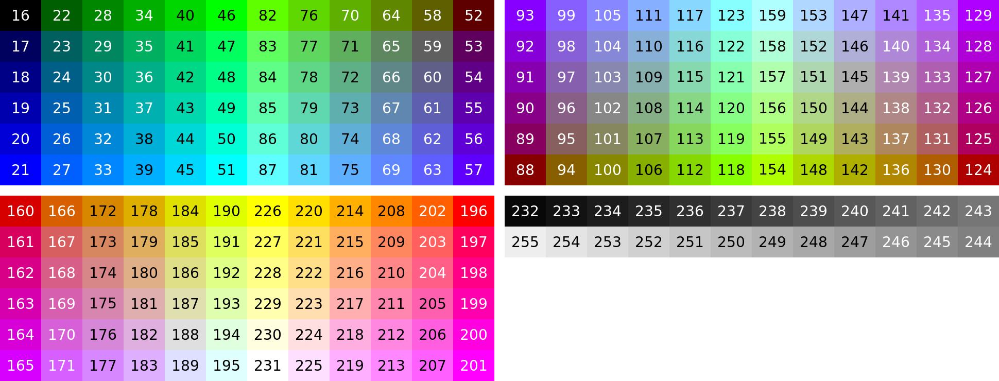

Bashline
========

Tiny, fast Powerline-like Bash prompt with max exec time
<https://github.com/superjer/bashline>

What you get
------------

  * Color-coded hostnames when you SSH to different machines.
  * Powerline-like path with abbreviations for favorite dirs.
  * Git branch, detached head, merge- or rebase-state (__git_ps1).
  * Color-coded Git working dir indicators:
      * D - dirty   - blue  - tracked files have modifications
      * I - index   - green - files have been indexed / added
      * U - unknown - red   - untracked files present
  * Git status is not allowed to take more than 1 second.
      * If it takes too long you will see a ? instead of D/I/U.
  * Error code from last ran command ($?).

Dependencies (you should already have these)
--------------------------------------------

  * 256-color term  - needed for this to work at all
  * Git             - to enable working dir status indicators
  * __git_ps1       - to see branch name, merge status, etc.
  * timeout         - to enable max exec time feature
  * Bash 4+         - to enable host colors, fav dirs, & Git status colors

Install and personalize Bashline
--------------------------------

  To install, just source bashline.sh in your .bashrc file. Like this:

    . /path/to/bashline.sh

  Here's an example configuration for host colors: (Bash 4+ required)

    bashline_hosts[lala]="230 128" # 230 foreground, 128 background
    bashline_hosts[lois]="201 55"
    bashline_hosts[clark]="231 160"
    bashline_hosts[swamp]="148 22"
    bashline_hosts[xenon]="160 234"
    bashline_hosts[kristi]="17 214"
    bashline_hosts[tengen]="231 198"
    bashline_hosts[creeper]="16 112"
    bashline_hosts[infocom]="226 211"
    bashline_hosts[krypton]="99 54"
    bashline_hosts[macpork]="87 99"
    bashline_hosts[icecrown]="51 18"
    bashline_hosts[magellan]="226 202"
    bashline_hosts[ferdinand]="88 172"
    bashline_hosts[swingline]="124 228"
    bashline_hosts[snickerdoodle]="214 25"

  Here's an example configuration for favorite dirs: (Bash 4+ required)

    bashline_favs[/var/www/html/superjer.com]="♥ j"
    bashline_favs[/var/www/html/mcdiddys.com]="♥ mcd"
    bashline_favs[/weirdly/long/path/that/makes/the/prompt/sad]="♥ a short name"

  You can choose your own colors. Here's the 256-color terminal palette in pictures:

  

  If you have Powerline Fonts installed, get Bashline to use the fancy symbols:

    bashline_powerline_font=on

  You can also shorten host and usernames to your liking:

    bashline_host_shorten=5  # shorten host name to just 5 characters
    bashline_user_shorten=2  # shorten your name to just 2 characters

Powerline Fonts
---------------

  For the best visuals, install a Powerline Font, and enable as shown above.

  <https://github.com/Lokaltog/powerline-fonts>

  Fonts only need to be installed on your client machine. If you are using
  SSH there is no need to install the fonts on the remote machine.

Note
----

  Bashline will attempt to degrade gracefully if there are missing
  dependencies. If you are missing a feature, you probably need to
  install or upgrade the relevant program.
